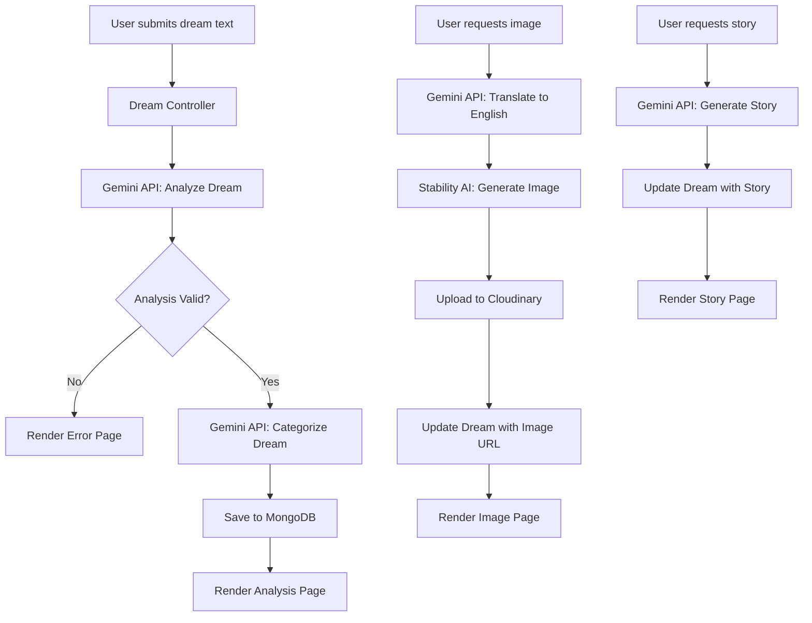

# 🌙 Dream Journal (Rüya Günlüğü) - Repository Analysis

A comprehensive analysis of the **Dream-Journal** project by [Eray-OZ](https://github.com/Eray-OZ/Dream-Journal).

---

## 📋 Overview

**Dream Journal** is a web application that allows users to record their dreams and receive AI-powered analysis and visualization. This project was developed as a final project for a Software Engineering course.

| Attribute            | Details                                                           |
| -------------------- | ----------------------------------------------------------------- |
| **Repository**       | [Eray-OZ/Dream-Journal](https://github.com/Eray-OZ/Dream-Journal) |
| **Primary Language** | EJS (68.6%), JavaScript (31.4%)                                   |
| **Commits**          | 12                                                                |
| **License**          | ISC                                                               |

---

## ✨ Key Features

1. **Dream Recording** - Users can input their dreams as text into the system
2. **AI-Powered Analysis** - Using **Gemini API** (Google AI) for:
   - Automatic symbolic and psychological dream interpretation
   - Dream categorization (Fear, Relationship, Work, Family, Past, Future, Other)
   - Story generation - continuing the dream narrative
3. **Image Generation** - Using **Stability AI** to generate dreamlike visuals based on dream content
4. **Cloud Storage** - Generated images are uploaded and hosted on **Cloudinary**
5. **Data Persistence** - All data (dreams, interpretations, stories, image URLs) stored in **MongoDB**
6. **User Authentication** - Session-based user management

---

## 🛠️ Tech Stack

### Backend

| Technology            | Purpose               |
| --------------------- | --------------------- |
| **Node.js**           | Runtime environment   |
| **Express.js v5.1.0** | Web framework         |
| **Mongoose v8.13.2**  | MongoDB ODM           |
| **express-session**   | Session management    |
| **bcrypt**            | Password hashing      |
| **dotenv**            | Environment variables |

### Frontend

| Technology | Purpose                                   |
| ---------- | ----------------------------------------- |
| **EJS**    | Template engine for server-side rendering |

### External APIs & Services

| Service                    | Purpose                                       |
| -------------------------- | --------------------------------------------- |
| **Gemini API (Google AI)** | Dream analysis, translation, story generation |
| **Stability AI**           | AI image generation                           |
| **Cloudinary**             | Image hosting and CDN                         |
| **MongoDB**                | Database                                      |

### Dependencies (from `package.json`)

```json
{
  "axios": "^1.8.4",
  "bcrypt": "^5.1.1",
  "cloudinary": "^2.6.1",
  "dotenv": "^16.5.0",
  "ejs": "^3.1.10",
  "express": "^5.1.0",
  "express-fileupload": "^1.5.1",
  "express-session": "^1.18.1",
  "form-data": "^4.0.2",
  "method-override": "^3.0.0",
  "mongoose": "^8.13.2",
  "nodemon": "^3.1.9",
  "validator": "^13.15.0"
}
```

---

## 📁 Project Structure

```
Dream-Journal/
├── config/              # Database configuration
│   └── db.js
├── controller/          # Business logic controllers
│   ├── controller.dream.js
│   └── controller.user.js (assumed)
├── middleware/          # Express middleware
├── models/              # Mongoose schemas
│   ├── Dream.js
│   └── User.js (assumed)
├── public/
│   └── images/          # Static assets
├── routes/              # Express route definitions
│   ├── router.pages.js
│   ├── router.dream.js
│   └── router.user.js
├── views/               # EJS templates
│   ├── analysis.ejs
│   ├── image.ejs
│   ├── story.ejs
│   ├── journal.ejs
│   ├── error.ejs
│   └── ...
├── server.js            # Application entry point
├── package.json
├── package-lock.json
├── .gitignore
└── README.md
```

---

## 🔄 Application Flow



---

## 🔑 Core Functionality Analysis

### 1. Dream Analysis (`addDream`)

- Sends dream content to Gemini API with Turkish prompt for psychological analysis
- Categorizes dreams into predefined categories
- Validates AI response and handles invalid inputs

### 2. Image Generation (`generateImage`)

- Translates Turkish dream content to English using Gemini
- Generates dreamlike images using Stability AI Core endpoint
- Uploads generated images to Cloudinary using buffer streams
- Stores the Cloudinary URL in the database

### 3. Story Generation (`getStoryPage`)

- Uses Gemini API to create a continuation story based on the dream
- Appends the generated story to the dream document

### 4. Dream Filtering (`filterDream`)

- Supports filtering by category
- Supports text search in title and content fields
- Uses regex for case-insensitive matching

---

## 🔒 Security Considerations

| Feature                   | Implementation            |
| ------------------------- | ------------------------- |
| **Session Management**    | 1-hour cookie expiration  |
| **Password Security**     | bcrypt for hashing        |
| **Environment Variables** | dotenv for sensitive data |
| **Input Validation**      | validator.js library      |

---

## ⚠️ Potential Improvements

1. **Error Handling** - More comprehensive error handling and user feedback
2. **Rate Limiting** - Add API rate limiting for external service calls
3. **Validation** - Enhanced input sanitization for dream content
4. **Testing** - Add unit and integration tests (currently no test suite)
5. **TypeScript** - Consider migrating to TypeScript for type safety
6. **Caching** - Implement caching for repeated API calls
7. **Pagination** - Add pagination for dream journal list
8. **API Documentation** - Add Swagger/OpenAPI documentation

---

## 🚀 Getting Started

### Prerequisites

- Node.js (v18+ recommended)
- MongoDB instance
- API Keys for:
  - Google Gemini API
  - Stability AI
  - Cloudinary

### Environment Variables

```env
PORT=3000
SECRET=your_session_secret
GEMINI_API_KEY=your_gemini_key
STABILITY_API_KEY=your_stability_key
CLOUD_NAME=your_cloudinary_name
CLOUD_API_KEY=your_cloudinary_key
CLOUD_API_SECRET=your_cloudinary_secret
MONGODB_URI=your_mongodb_connection_string
```

### Installation

```bash
# Clone the repository
git clone https://github.com/Eray-OZ/Dream-Journal.git

# Navigate to project directory
cd Dream-Journal

# Install dependencies
npm install

# Start the development server
npm start
```

---

## 📊 Summary

The **Dream Journal** project demonstrates a solid full-stack web application with modern AI integrations. It showcases:

- ✅ Clean MVC architecture
- ✅ Multiple AI API integrations (Gemini, Stability AI)
- ✅ Cloud-based image storage
- ✅ Session-based authentication
- ✅ Server-side rendering with EJS
- ✅ MongoDB with Mongoose ODM

This is a well-structured academic project that effectively combines traditional web development with modern AI capabilities.

---

_Analysis generated on: December 28, 2025_
