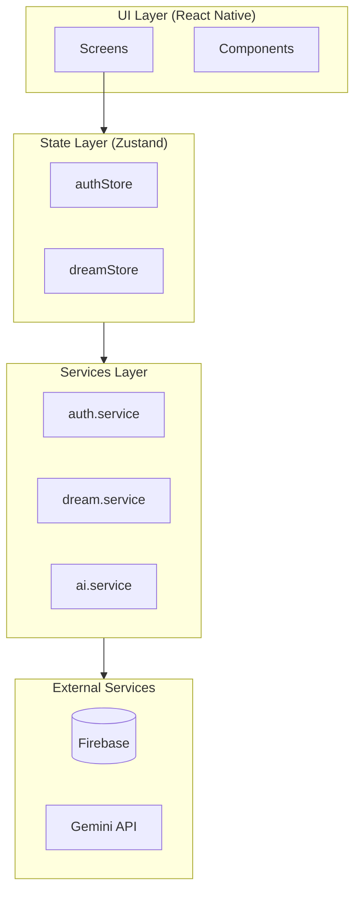
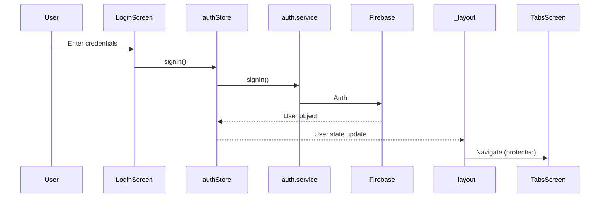
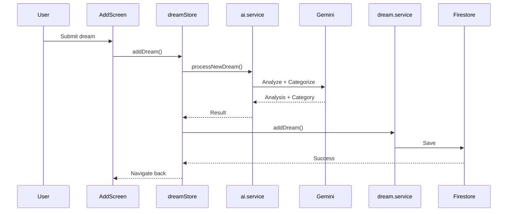

# System Patterns: REM

## Architecture Overview



## Design Patterns

### 1. Service Layer Pattern

All external API calls isolated in `/services/`:

- `firebase.js` - Firebase initialization
- `auth.service.js` - Authentication operations
- `dream.service.js` - Firestore CRUD
- `ai.service.js` - Gemini API calls

### 2. Store Pattern (Zustand)

Centralized state in `/store/`:

- `authStore.js` - User state, auth actions
- `dreamStore.js` - Dreams state, CRUD actions, AI integration

### 3. File-based Routing (Expo Router)

```
app/
├── (auth)/         # Auth group (login, register)
├── (tabs)/         # Tab group (home, add, profile)
├── dream/[id].jsx  # Dynamic route
└── _layout.tsx     # Root layout with auth guards
```

### 4. Animation Patterns (Reanimated)

- **Tactile Scale**: `ScaleButton.tsx` - Reusable spring-scaling primitive for all touch areas.
- **Dynamic Underlines**: `WavyUnderline.tsx` - Animated SVG path drawing for header subtitles.
- **Staggered Layouts**: Standardized use of `FadeInDown` with sequential delays for list items.

## Component Relationships

### Authentication Flow



### Dream Creation Flow



## Key Technical Decisions

| Decision                    | Rationale                                                 |
| --------------------------- | --------------------------------------------------------- |
| Expo (not bare RN)          | Faster development, managed workflow                      |
| Zustand (not Context)       | Simpler than Redux, better than Context for complex state |
| Firestore (not Realtime DB) | Better querying, offline support built-in                 |
| Gemini 2.0 Flash            | Fast, cost-effective for text analysis                    |

## Data Flow

```
User Input → Screen → Zustand Store → Service → Firebase/Gemini
                ↑                                      ↓
                └──────────── State Update ←──────────┘
```
